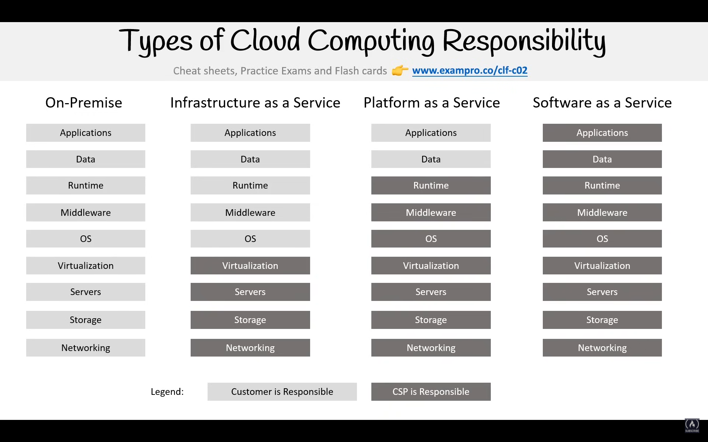
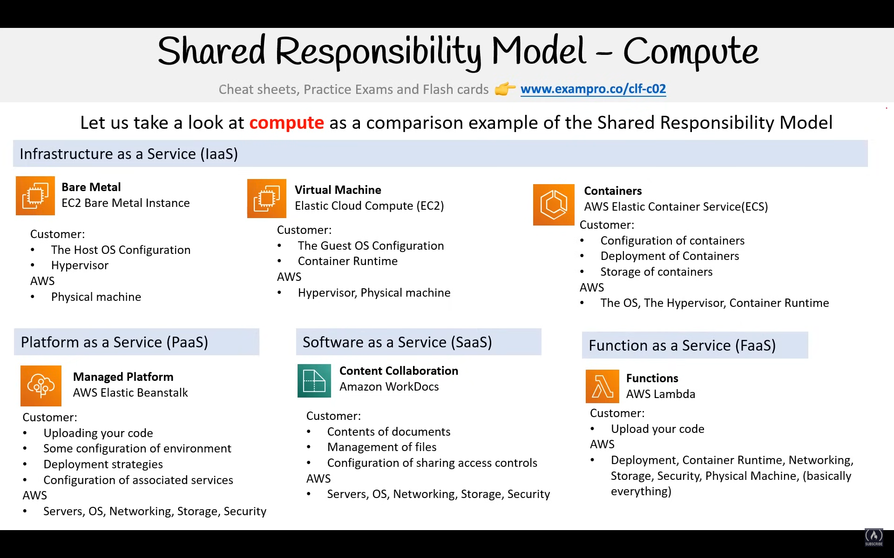
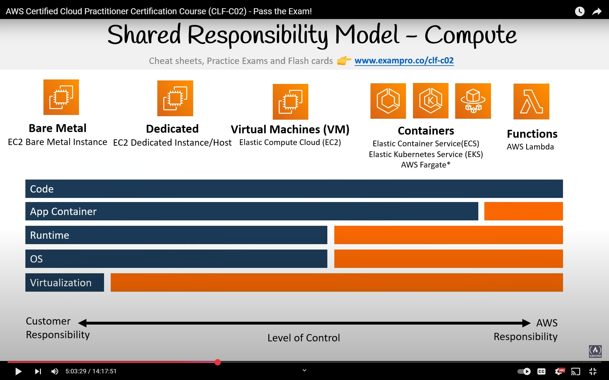
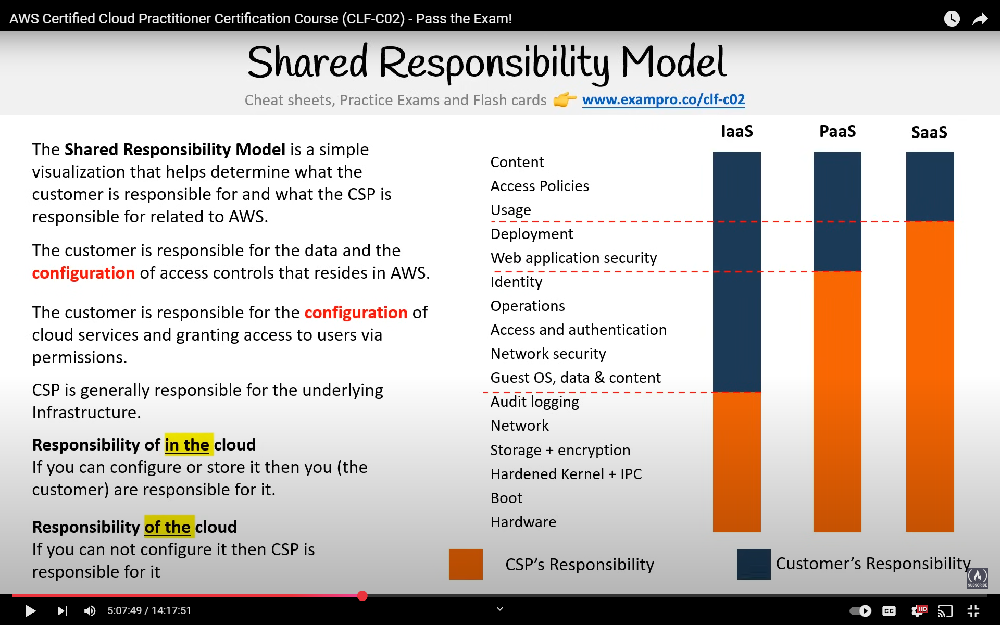
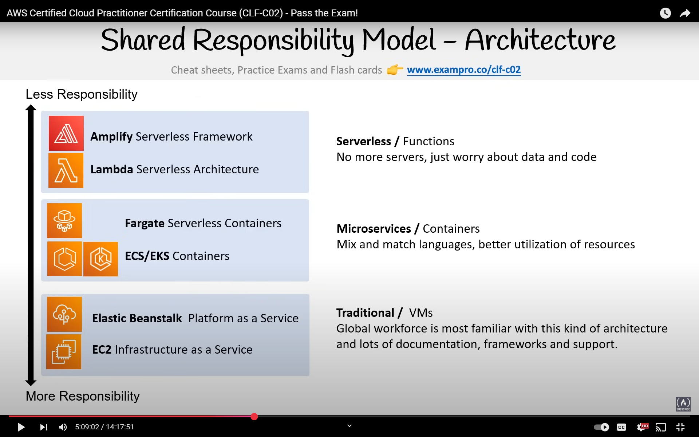

# AWS Development Environment and Security

## AWS CloudShell

- Browser-based shell environment with no additional setup required
- Free service with 1 GB persistent storage per region
- Pre-installed development tools and AWS utilities:
  - AWS CLI (latest version)
  - Python, Node.js, pip, npm
  - Git, Make, Docker
  - Common development tools (jq, zip, vim)
- Persistent across sessions - your files and settings remain
- Multiple shell options for your preference:
  - Bash (default)
  - PowerShell
  - Z shell (zsh)

## Infrastructure as Code (IaC) Options

### AWS CloudFormation

- AWS's native declarative IaC service
- Template-based infrastructure provisioning
- Key benefits:
  - Predictable and consistent deployments
  - Version control for infrastructure
  - Built-in dependency management
  - Automatic rollback on failures
- Supports JSON and YAML formats
- Best for teams requiring strict infrastructure control

### AWS Cloud Development Kit (CDK)

- Modern, code-first infrastructure definition
- Write infrastructure using familiar programming languages:
  - TypeScript/JavaScript (recommended)
  - Python
  - Java
  - C#/.NET
  - Go
- Advantages:
  - Leverage your IDE's features (autocomplete, type checking)
  - Reuse code through regular programming patterns
  - Access to the full AWS API
  - Built-in best practices and security policies
- Important characteristics:
  - Generates CloudFormation templates
  - Maintains infrastructure state
  - Idempotent operations
  - Extensive construct library

## Development Environments

### AWS Cloud9

- Cloud-based IDE with collaborative features
- Direct AWS integration:
  - AWS service integration
  - AWS credential management
  - Lambda function development
- Real-time pair programming capabilities
- Terminal access with AWS CLI pre-configured

### AWS Toolkit for VS Code

1. AWS Explorer

   - Browse and manage AWS resources directly from VS Code
   - Quick access to CloudWatch logs and Lambda functions

2. AWS CDK Explorer

   - Visualize CDK stacks and resources
   - Deploy stacks directly from VS Code

3. Amazon ECS Integration

   - IntelliSense for task definitions
   - Container image management
   - Service deployment tools

4. Serverless Development
   - Local debugging of Lambda functions
   - SAM template validation and deployment
   - API Gateway testing

## Security and Access Management

### AWS Access Keys

- Secure credentials for programmatic AWS access
- Components:
  - Access Key ID (like a username)
  - Secret Access Key (like a password)
- Best practices:
  - Maximum of two active keys per IAM user
  - Store securely in `~/.aws/credentials`
  - Rotate keys regularly
  - Never commit keys to version control
  - Use AWS CLI profiles for multiple accounts

## AWS Documentation and Resources

- Comprehensive documentation with practical examples
- Resources:
  - AWS Documentation Portal
  - AWS Workshops
  - AWS Labs on GitHub
  - AWS Well-Architected Framework
  - AWS Solutions Library

## AWS Shared Responsibility Model

A framework defining security and compliance responsibilities:

1. Customer Responsibilities ("Security in the Cloud")

   - Application and data security
   - Identity and access management
   - Operating system configuration:
     - Patching and updates
     - Security hardening
     - Network configuration
   - Data protection:
     - Encryption choices
     - Key management
     - Data classification
     - Access patterns

2. AWS Responsibilities ("Security of the Cloud")
   - Global infrastructure security:
     - Physical data centers
     - Network infrastructure
     - Virtualization infrastructure
   - Managed services:
     - Compute infrastructure
     - Storage systems
     - Database services
     - Network security

Key Principle: AWS manages the security OF the cloud, while customers manage security IN the cloud.

Note: AWS Fargate implements a unique shared responsibility model, shifting more operational responsibilities to AWS.

