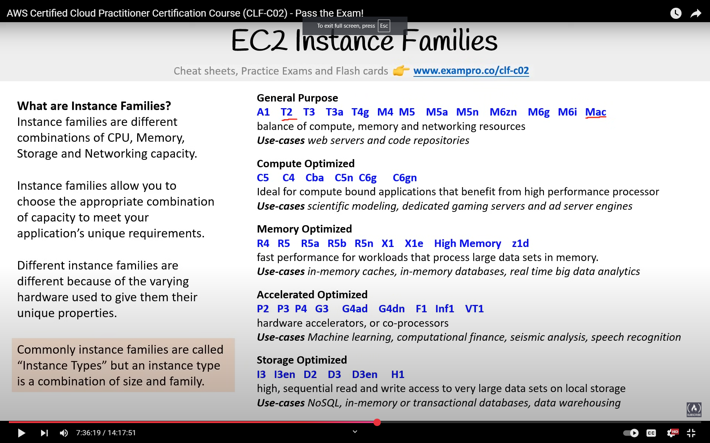
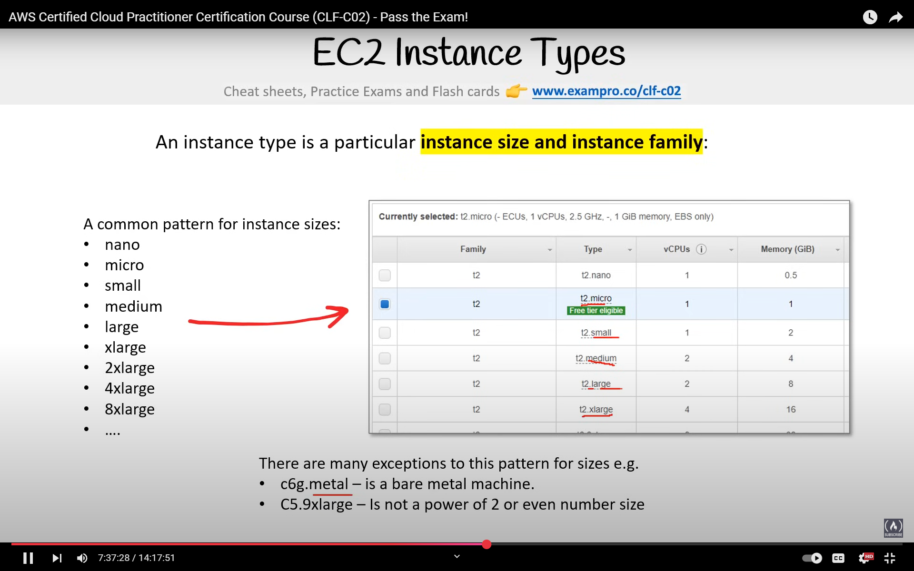
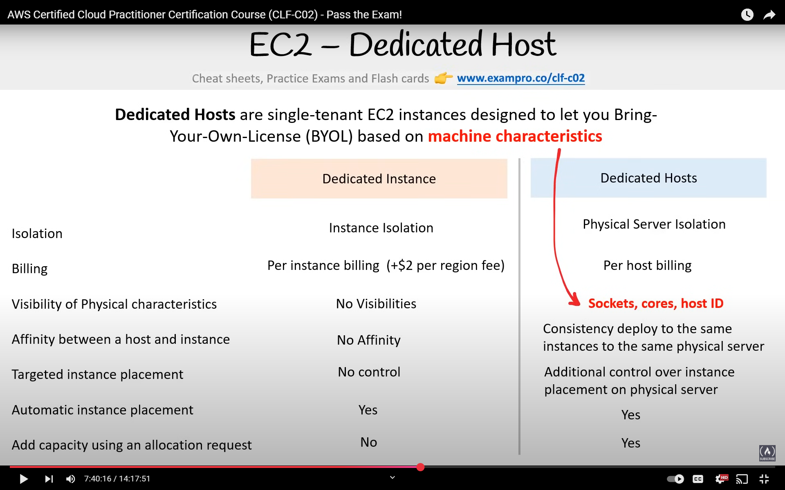
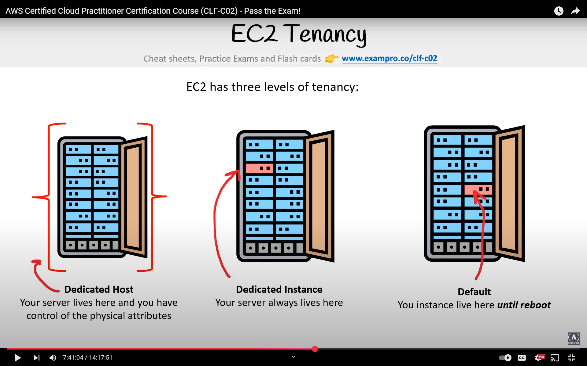

## Cloud Native Networking Service

### Virtual Private Cloud

- Logically isolated AWS resources
- We can choose IP range using CIDR range
- Example: 10.0.0.0/16 -> 65,536 IPs

### Network Access Control List (NACLs)

- Virtual firewall at subnet level
- Allow and deny rules both possible

### Security Groups

- Virtual firewall at instance level
- Implicitly denies all traffic and we can only create allow rules
- Need to use Internet Gateway service for subnet to be accessible from public in VPC

---

- CloudFront is a really powerful caching service from AWS with a lot of control over rules

---

## EC2 - Elastic Compute Cloud

- Highly configurable virtual servers
- Resizable and takes minutes to spin up
- Anything in AWS underneath runs on EC2

### Instance Family

Types are:

1. General purpose
2. Compute optimized
3. Memory optimized
4. Accelerator optimized
   - Hardware accelerators for ML, AI tasks
5. Storage optimized
   - High sequential reads and writes

### EC2 Instance Type

- Instance type is a particular instance size and family
- Generally naming follows power of 2 but there are exceptions
- Instance size generally doubles in size and price

- Dedicated hosts and dedicated instances are two different things

## 

