## Elastic IP

- A service to reserve IP addresses for important resources that require a static IP address

## AMI and Launch Template

### AMI (Amazon Machine Images)

- Configuration for operating system, application server, and applications
- Required to launch EC2 instances
- Can create custom AMIs to use with launch templates

### Launch Template

- Automates instance launching process
- Compatible with EC2 Auto Scaling and EC2 Fleet
- Uses AMI to launch instances on demand

## Auto Scaling Group

- Configurable policies for instance scaling
- Customizable minimum, maximum, and desired capacity of running instances

## ALB - Application Load Balancer

- Must use same Availability Zones (AZs) as Auto Scaling Group to utilize the same subnets
- Requires a target group by load balancer category
- Provides ALB URL for DNS configuration, handling all other infrastructure requirements

### Load Balancer Types

1. Instance

   - Supports load balancing to specific VPC

2. IP Address

   - Works with VPC and on-premises
   - Supports multiple IPs and network interfaces
   - Ideal for microservices architecture

3. Lambda Function

   - Works with single Lambda function
   - Compatible with Application Load Balancer only

4. Application Load Balancer
   - Offers flexibility of Network Load Balancer for TCP requests
   - Works with static IPs and PrivateLink

---

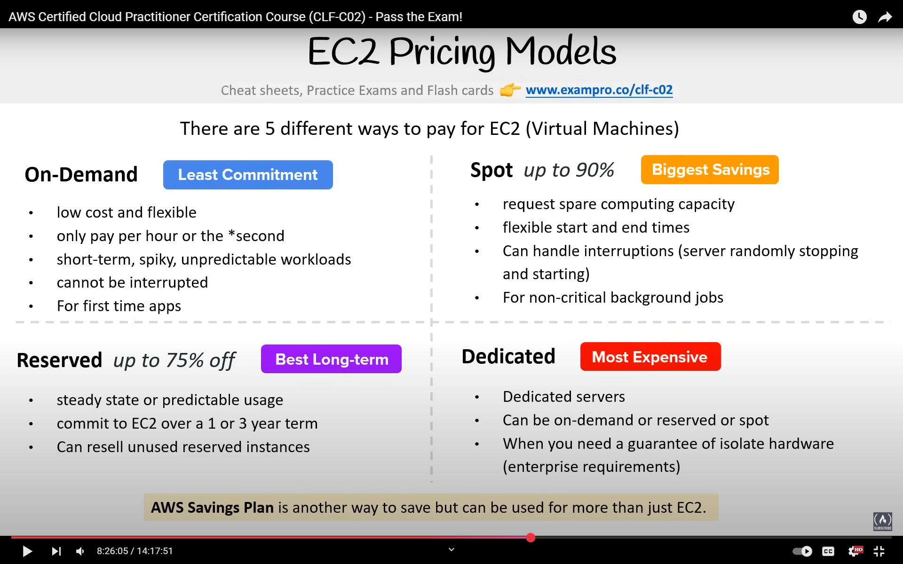

---

## EC2 Pricing

### On-Demand

- Pay-as-you-go model
- No commitment required
- Ideal for short-term, spiky, unpredictable workloads or testing

### Reserved Instances (RI)

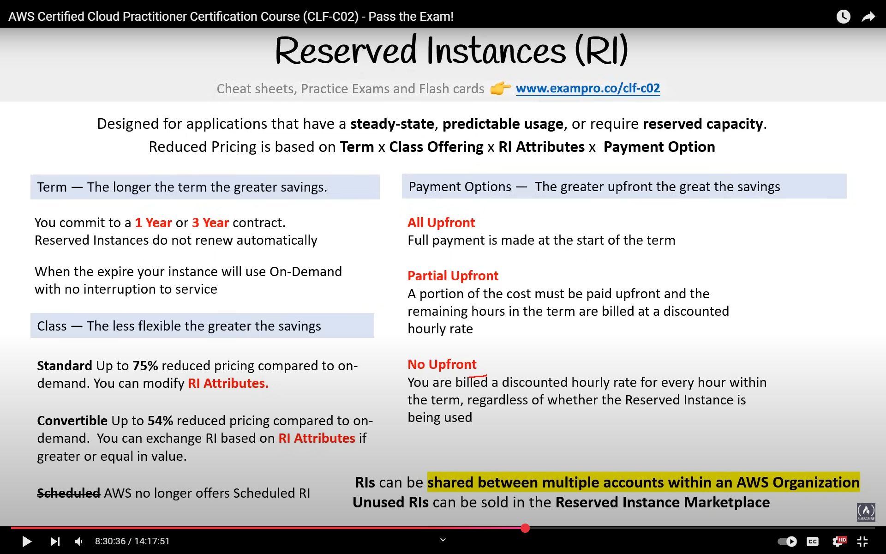

#### RI Attributes (Affecting Price)

1. Instance Type (e.g., t2.micro, m4.large)
2. Region
3. Tenancy (Shared or Dedicated)
4. Platform (Windows or Linux)

#### Regional and Zonal RI

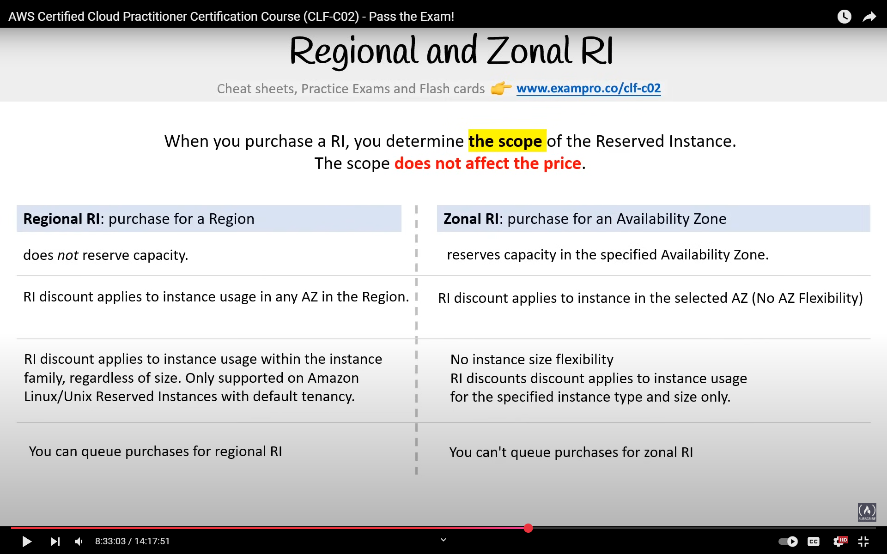

#### RI Limits

- 20 Regional Reserved Instances limit
- 20 Zonal Reserved Instances per AZ

##### Regional Limits

- Cannot exceed on-demand instance limit
- Default limit is 20
- Ensure on-demand limit is equal or higher before purchasing RI

##### Zonal Limits

- Can exceed on-demand running instance limit
- Example: With 20 running instances and 20 Zonal RIs, total capacity can be 40

#### Capacity Reservation

- Limited hardware per AZ and datacenter
- Service to reserve specific instance types in specific regions and AZs
- Charged on-demand regardless of usage
- Can be combined with Regional Reserved Instances for discounts

---

#### Standard vs Convertible RI

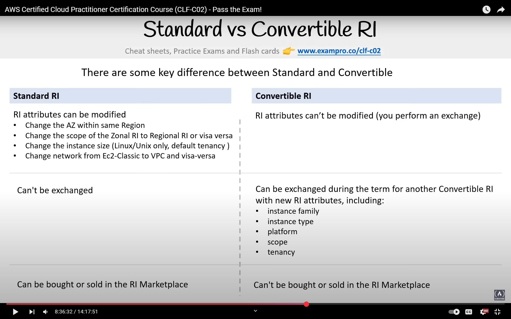

#### RI Marketplace

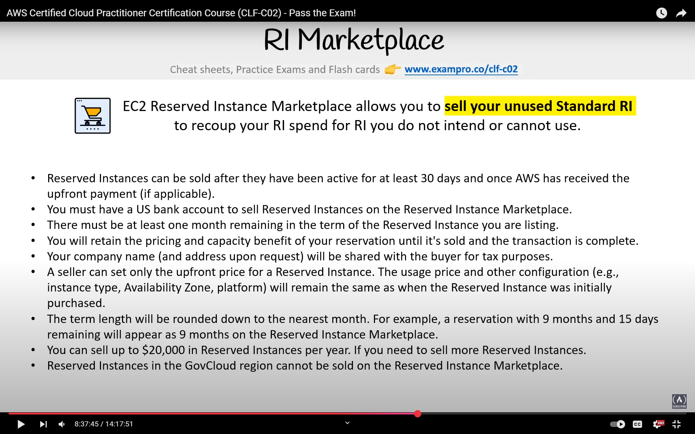

---

### Spot Instances

- Utilizes AWS's unused capacity
- Up to 90% discount compared to on-demand pricing
- Designed for flexible workloads requiring low compute costs
- AWS can terminate instances at any time
- AWS termination: Partial hour discount applied
- User termination: Full hour charged
- AWS Batch service supports Spot Instance pricing

### Dedicated Instances

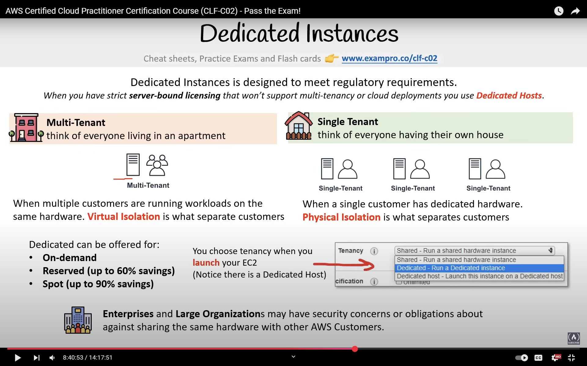

### Savings Plans

- Simplified version of Reserved Instances

#### Types of Savings Plans

1. Compute Savings Plan

   - Covers EC2, Lambda, Fargate, etc.

2. EC2 Savings Plan

   - Applies to committed EC2 family

3. SageMaker Savings Plan
   - 1 or 3-year commitment options

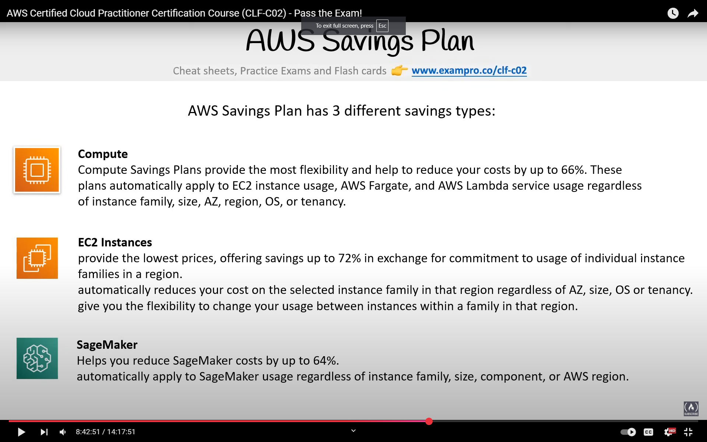

---

## Zero Trust Model

- Trust no one, verify everything

### IAM

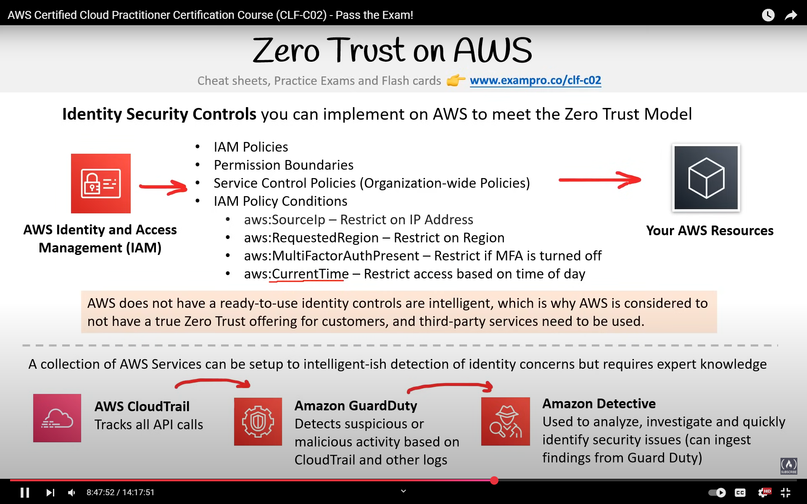

- AWS doesn't provide intelligent identity security controls; implementation responsibility lies with the user

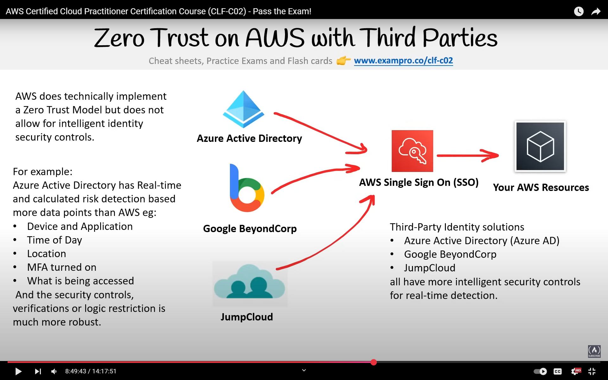

---

### Directory Service

- Maps network resources to their network addresses
- Shared information infrastructure for locating, managing, and administrating resources
- Examples: DNS, Azure Active Directory, Apache Directory Server

### Identity Providers

- Services like Facebook, Google, and GitHub
- Supports OpenID, OAuth, SAML
- Used for service authentication

#### Authentication Methods

1. SSO (Single Sign-On)
   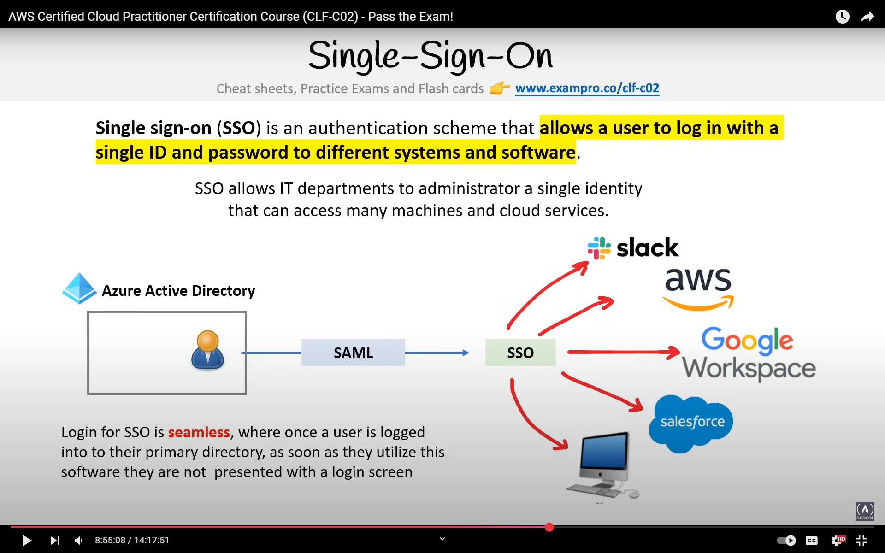

2. LDAP (Lightweight Directory Access Protocol)
   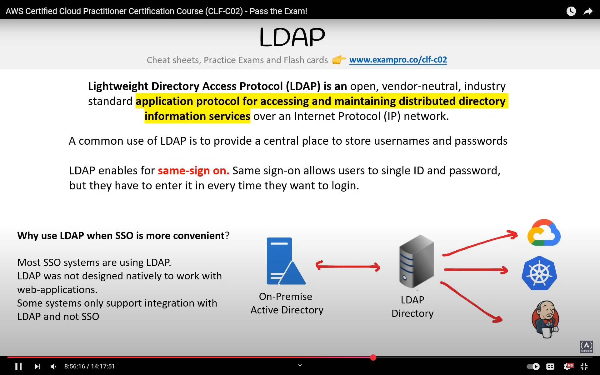

3. MFA (Multi-Factor Authentication)
   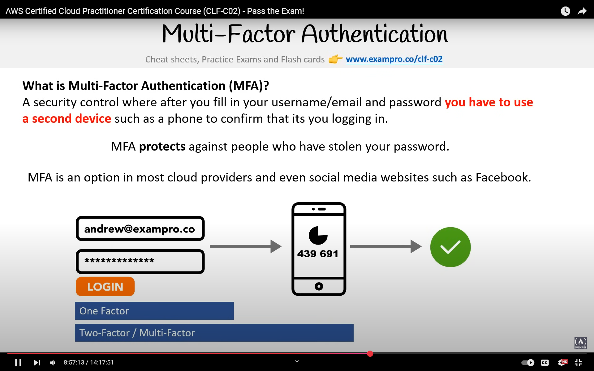
   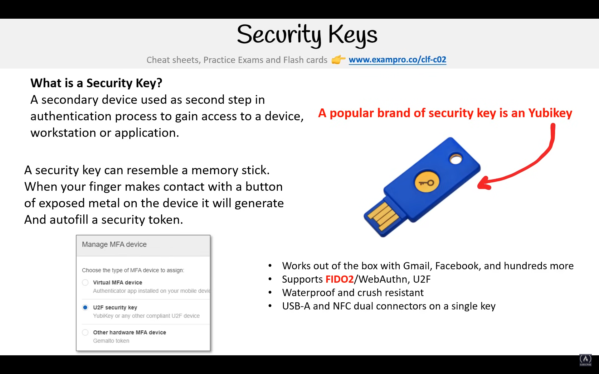
