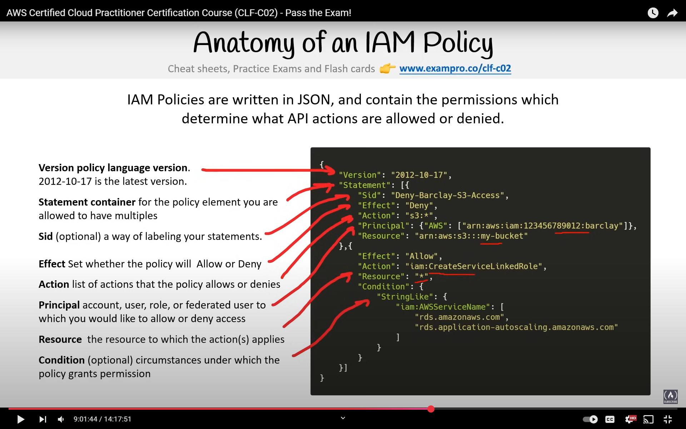

# AWS Identity and Access Management (IAM)

## IAM Overview

- IAM policies are written in JSON
- Used to manage users, groups, policies, and their access to AWS resources
- Two main components:
  1. IAM Policies
     - Used to grant permissions to identities
     - Identities include users, groups, and roles
  2. IAM Permissions
     - API-level permissions
       

## Principle of Least Privilege (PoLP)

### 1. Just-Enough-Access (JEA)

- AWS actively implements this principle

### 2. Just-in-Time (JIT)

- Shortest time duration for policy permissions

### Notes

1. Netflix's ConsoleMe

   - Open-source tool for short-lived IAM policies
   - Enforces both JEA and JIT

2. Risk-based Adaptive Policies
   - Each attempt generates a risk score for potentially compromised requests
   - Based on location, device, IP, and service being accessed
   - Currently not available in AWS

## AWS Root User

- Created at time of account creation
- Cannot be deleted or restricted using IAM policies
- Only AWS Organization Service Control Policies can limit root user
- One root user per AWS account

### Important Root User Notes

1. Reserved for specific tasks only
2. Should not be used for daily tasks
3. Never use Root User Access Keys
4. Only root user can:
   - Change account name, email, password, and root access keys
   - Close AWS account
   - Cancel support plan
   - Restore IAM permissions
   - And other privileged operations

## AWS Single Sign-On (SSO)

- Connect workforce identities in AWS once and manage centrally

## Application Integration

### Common System Design Patterns

1. Queuing

   - Simple messaging system with senders and receivers
   - Not real-time; receiver needs to pull
   - Messages are deleted after consumption
   - AWS Simple Queue Service (SQS)

2. Streaming

   - Uses producers and consumers
   - Consumers react to events or messages
   - Messages persist in stream for complex operations
   - Real-time processing
   - Amazon Kinesis

3. Pub/Sub

   - Publishers and subscribers communicate via event bus
   - Real-time communication
   - Fully decoupled architecture
   - Amazon Simple Notification Service (SNS)
   - Ideal for microservices and distributed systems

4. API Gateway

   - Secure entry point for multiple API endpoints
   - Routes API calls to various services (Lambda, EC2, etc.)
   - Amazon API Gateway

5. State Machine

   - Condition-based state transitions
   - Handles errors, automatic retries, and logging
   - AWS Step Functions

6. Event Bus
   - Routes events from sources to targets based on rules
   - Amazon EventBridge (formerly CloudWatch Events)
   - Serverless event bus for real-time application integration
     

### AWS Integration Services

1. SNS - Pub/Sub messaging
2. SQS - Queue messaging
3. Step Functions - State machine orchestration
4. EventBridge - Serverless event bus
5. Kinesis - Real-time streaming data
6. Amazon MQ - Managed Apache ActiveMQ service
7. MSK (Managed Streaming for Apache Kafka)
8. API Gateway - REST API management
9. AppSync - Managed GraphQL service

## Container Services

### Containerization vs. Virtualization

1. VM vs. Containers
2. Monolith vs. Microservices
3. Kubernetes

   - Open-source container orchestration system
   - Originally by Google, now maintained by CNCF
   - Superior to Docker for distributed container management
   - Pods: Groups of containers with shared resources

4. Docker

   - CLI: Container management
   - Dockerfile: Container configuration
   - Compose: Multi-container management
   - Swarm: Container orchestration
   - DockerHub: Container registry
   - OCI (Open Container Initiative): Linux Foundation standard

5. Podman
   - OCI-compliant Docker alternative
   - Daemonless architecture
   - Supports pod creation
   - Requires Buildah for OCI image building
   - Requires Skopeo for container migration

## Organizations and Accounts

### AWS Control Tower

- Enterprise solution for secure multi-account AWS environment setup

1. Landing Zone

   - Best-practice baseline environment
   - Features: SSO, centralized logging, security auditing

2. Account Factory

   - Automated account provisioning
   - Pre-configured settings for networking and regions

3. Guardrails
   - Pre-packaged governance rules
   - Security and compliance controls
   - Applicable to accounts or organizations

Note: AWS Control Tower replaces AWS Landing Zones

## AWS Config

- Change management service for:

  1. Monitoring
  2. Enforcing
  3. Remediation

- Implements Compliance as Code (CaC)
- Region-specific activation required
- Features:
  - Compliance tracking
  - Change tracking
  - Resource inventory
  - Security risk analysis
- Paid service
- Supports custom rules and AWS best practice rules via Conformance Packs
