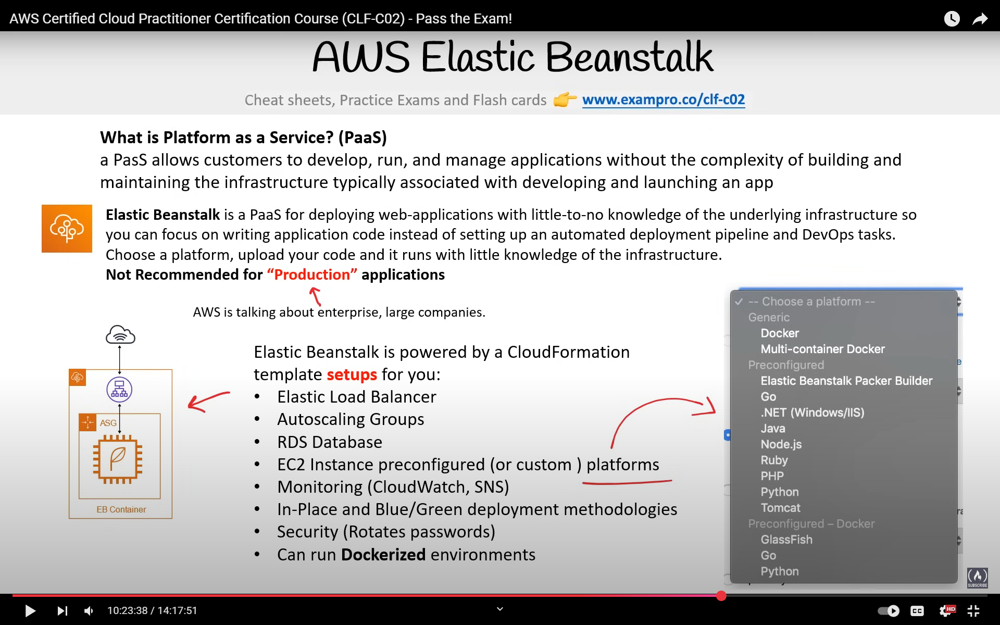
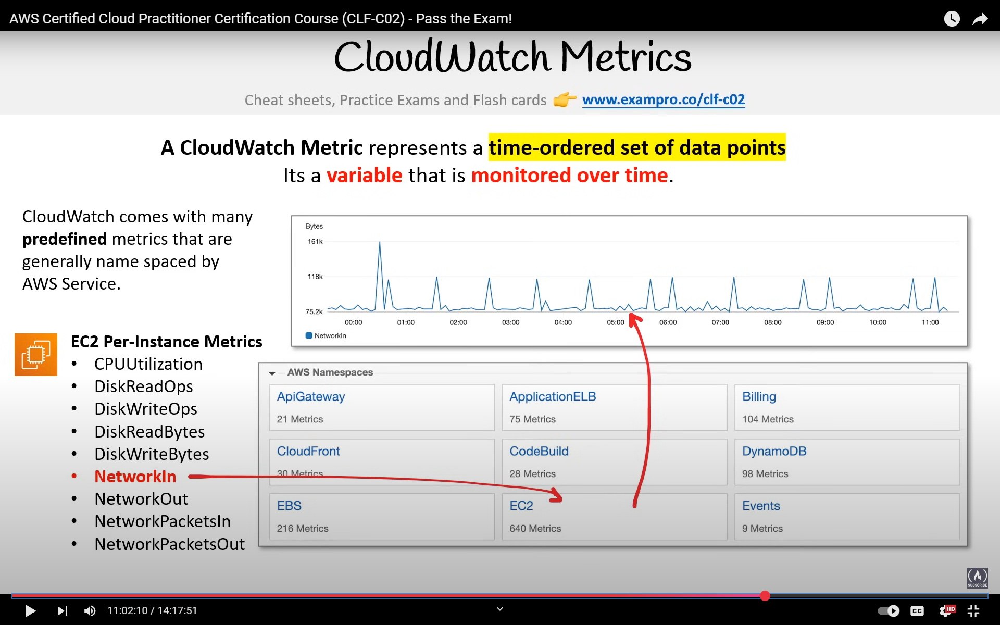
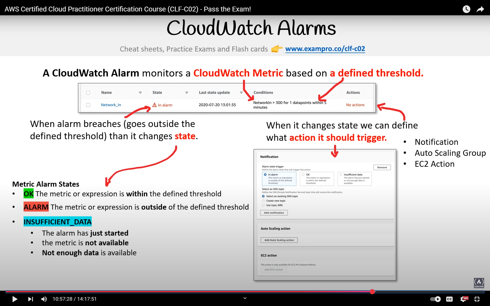
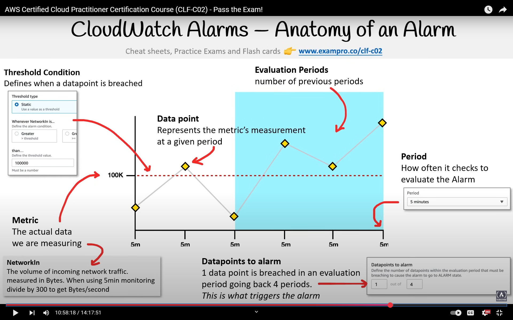

# AWS Services Overview

## AWS Quick Start

- Pre-built templates by AWS for deploying complex systems with minimal clicks

## Resource Management

### Tagging

- Key-value pairs assignable to AWS resources
- Benefits:
  - Resource management
  - Cost management
  - Operations management
  - Security
  - Governance and compliance
  - Automation
  - Workload optimization

### Resource Groups

- Collections of resources sharing one or more tags
- Can display resources based on:
  - Metrics
  - Alarms
  - Configurations
- Customizable resource display rules

## Business-Centric Services

- Amazon Connect - Virtual call center service
- Amazon WorkSpaces - Virtual remote desktop service
- Amazon WorkDocs - Shared collaboration service
- Amazon Chime - Video conferencing service
- Amazon WorkMail - Managed business email, calendar, and contacts service
- Amazon Pinpoint - Marketing campaign management service
- Amazon SES (Simple Email Service) - Transactional email service
- Amazon QuickSight - Business Intelligence (BI) service

## Provisioning Services

- AWS Elastic Beanstalk - Platform as a Service (PaaS) for web applications
  
- AWS OpsWorks - Configuration management service using Chef and Puppet
- AWS CloudFormation - Infrastructure modeling and provisioning service (IaC)
- AWS Quick Start - Pre-made packages for resource deployment
- AWS Marketplace - Digital catalog for software listings
- AWS Amplify - Mobile and web application framework with serverless backend
- AWS App Runner - Managed service for containerized web services and APIs
- AWS Copilot - CLI for quickly launching containerized applications
- AWS CodeStar - Unified interface for software development activities (e.g., LAMP stack)
- AWS Cloud Development Kit (CDK) - IaC using preferred programming languages

## Serverless Services

- Fully managed cloud services featuring:
  - High elasticity
  - High availability
  - High durability
  - Security by default
- Zero infrastructure management required
- Scale-to-zero capability
- Key services:
  - Amazon DynamoDB - NoSQL key-value and document database
  - Amazon S3 - Object storage
  - Amazon ECS on Fargate - Serverless container orchestration
  - AWS Lambda - Serverless functions
  - AWS Step Functions - State machine service
  - Amazon Aurora Serverless - On-demand relational database

## Windows on AWS

- Windows Server on EC2
- SQL Server on RDS
- AWS Directory Service - Microsoft Active Directory
- AWS License Manager - Microsoft license management
- Amazon FSx for Windows File Server - Managed scalable Windows storage
- AWS SDK - .NET support
- Amazon WorkSpaces - Windows virtual desktop
- AWS Lambda - PowerShell support
- AWS Migration Acceleration Program - Enterprise Windows migration methodology

## AWS License Manager

- Enables reuse of existing software licenses on AWS
- License types based on:
  - Virtual cores
  - Physical cores
  - Sockets
  - Number of machines
- Compatible with:
  - Dedicated hosts
  - Dedicated instances
  - Spot instances
- Works with EC2 and RDS
- Note: Microsoft Windows Server and SQL Server licenses require dedicated hosts

## AWS Logging

### 1. CloudTrail

- Logs API calls (SDK and CLI) between services
- Enables:
  - Governance
  - Compliance
  - Operational auditing
  - Risk auditing
- Captures:
  - Source IP
  - Event time
  - User identity
  - Region
  - Service details
- 90-day default log retention
- Extended retention possible via S3 and Amazon Athena for analysis

### 2. CloudWatch

Collection of monitoring services including:

- Logs
  - Centralized log management
  - Log streams: Sequential event monitoring
  - Log events: Individual log file entries
  - Log Insights: Interactive search and analysis
    - Custom query language
    - Up to 20 log groups
    - 15-minute timeout
    - 7-day result retention
- Metrics - Time-ordered data points
  
- Events (EventBridge) - Condition-based triggers
- Alarms - Notification system
  
  - Alarm anatomy:
    
- Dashboards - Visualization tools

### 3. AWS X-Ray

- Distributed tracing system for microservices
