## AI and ML Services

1. AI - Machine mimics human behavior
2. ML - Machine that gets better at tasks without explicit programming
3. DL - Machine with neural networks inspired by human brain for complex tasks

### Amazon SageMaker

- Fully managed service to build, train and deploy ML models
  - Apache MXNet - Open-source DL framework
  - TensorFlow and PyTorch - Open-source ML libraries

### Additional AI Services

- SageMaker Ground Truth - Data labeling service
- Augmented AI - SageMaker will use this queue for human review when not confident in prediction

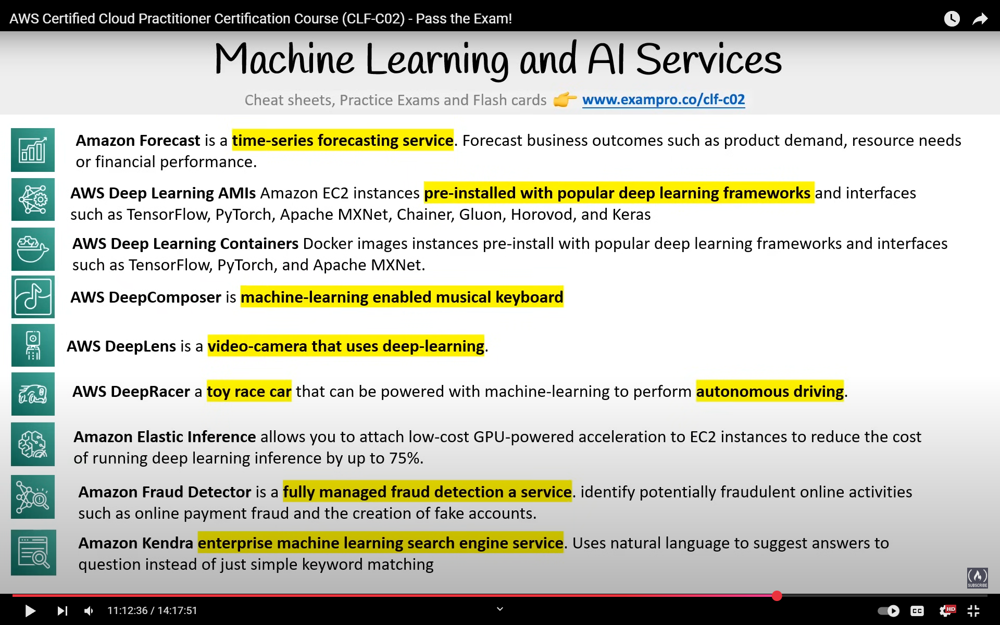
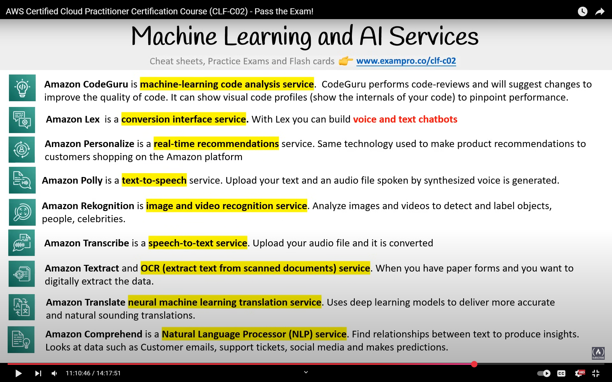
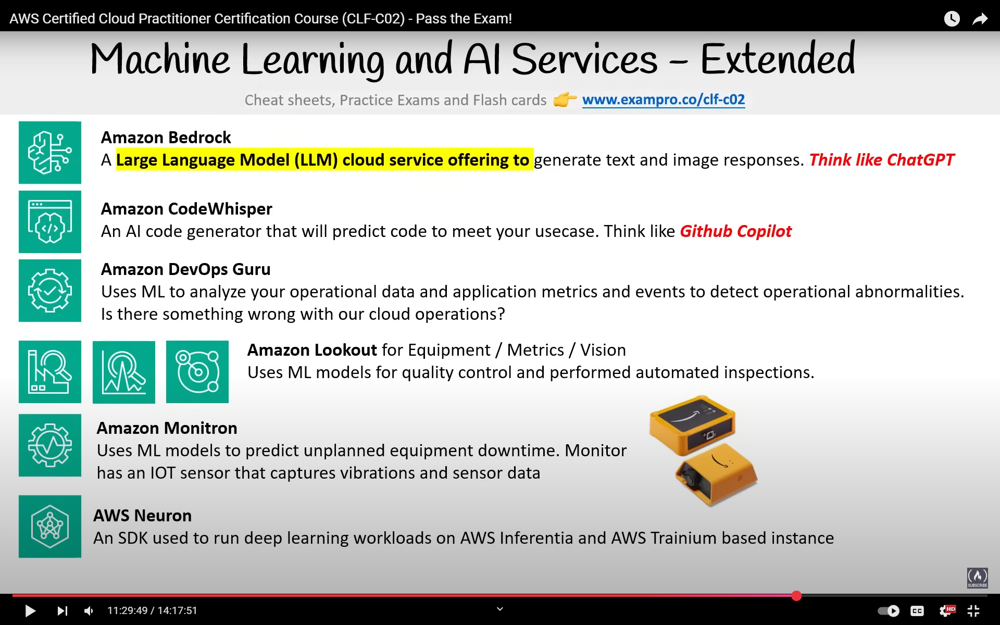

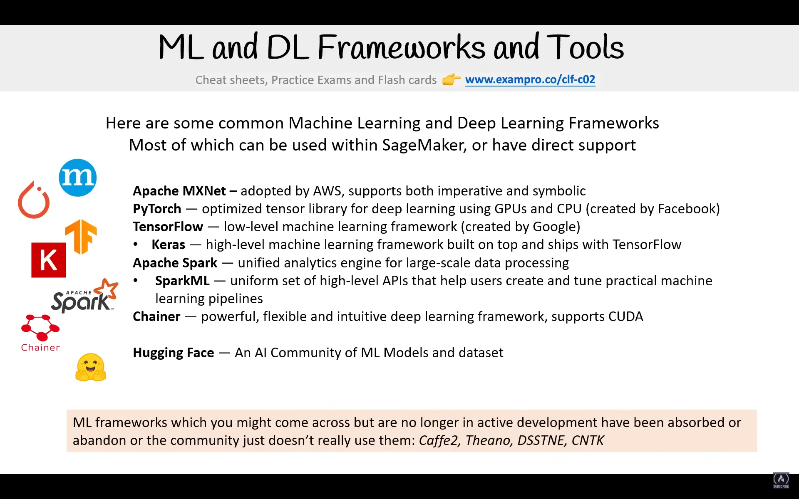

### MXNet

- AWS's preferred framework
- Supports multiple languages
- Scalable, flexible, portable
- Has two high-level interfaces:
  - Gluon API - Imperative programming
  - Module API - Symbolic programming

## Big Data and Analytics Services

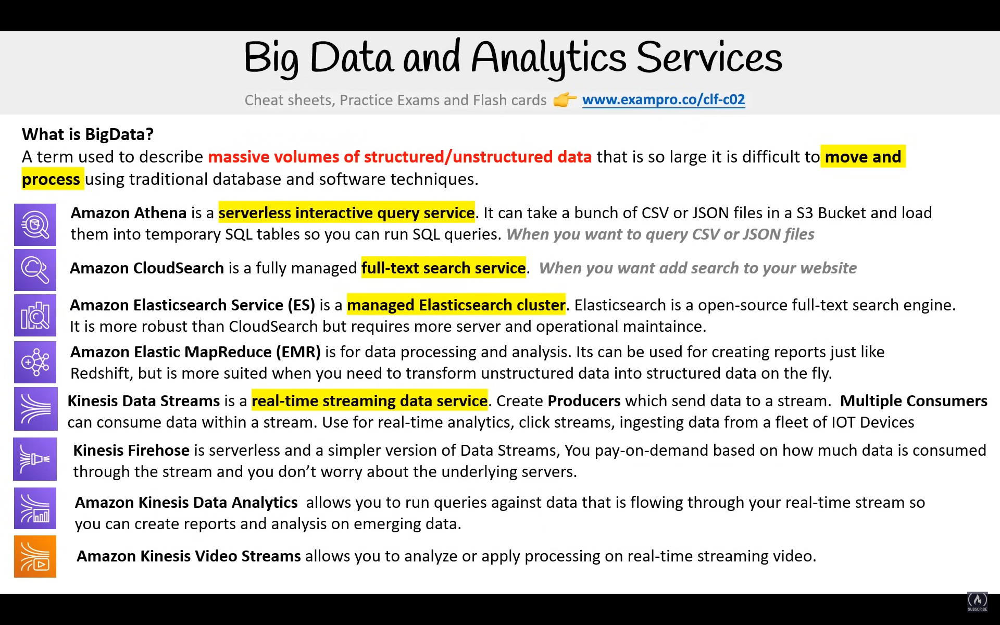
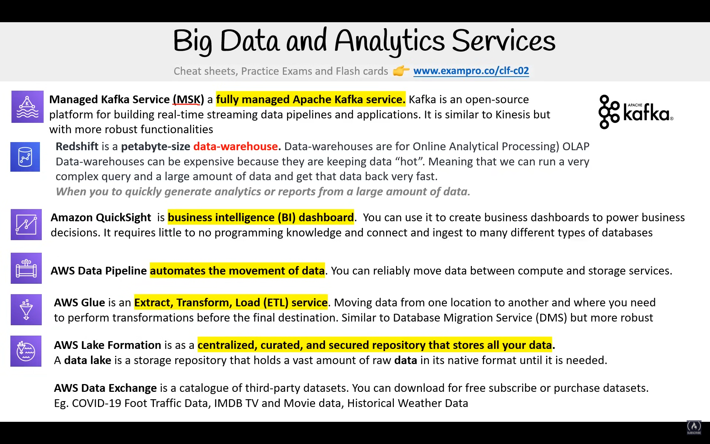

### Amazon QuickSight

- BI service to visualize data with minimum programming and can ingest various AWS storages or databases
- Uses SPICE - Super-fast, Parallel, In-memory, Calculation Engine
  - For blazing fast performance at scale
- QuickSight ML - Detect anomalies, perform accurate forecasting
- QuickSight Q - Ask questions on your data using natural language and get answers in seconds

---

### Hardware Partners

- Intel is founder of x86 instructions
- Special connection with AWS
- AWS uses Xeon Scalable processors and Habana Gaudi (AI training processor)
- GPU - To perform tasks in parallel
  - CUDA - NVIDIA API for working with its GPU

---

## AWS Well-Architected Framework

- Whitepaper created by AWS to help customers with:
  - Cloud workload
  - General definitions
  - Design principles
  - Review process
    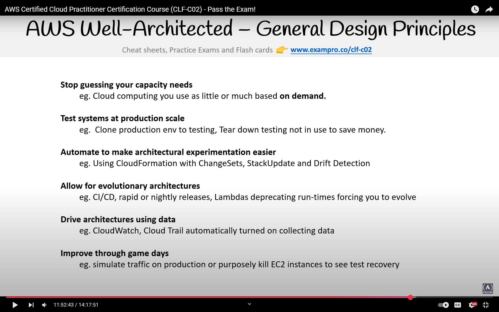
    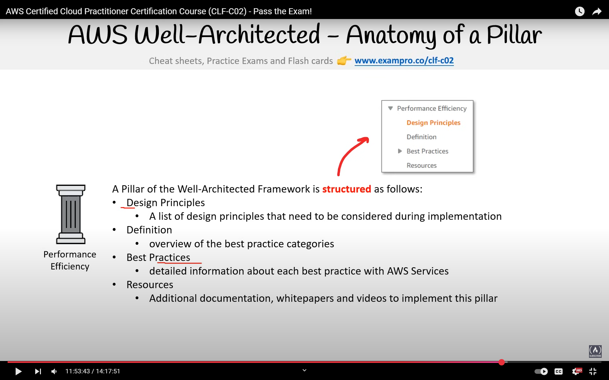
- AWS uses it internally
- Described in 5 pillars:
  1. Operational Excellence - Run and monitor systems
     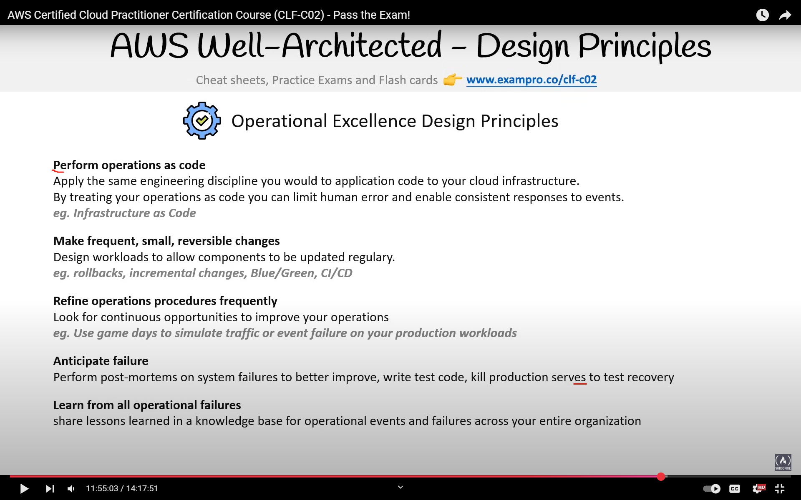
  2. Security - Protect systems and data
     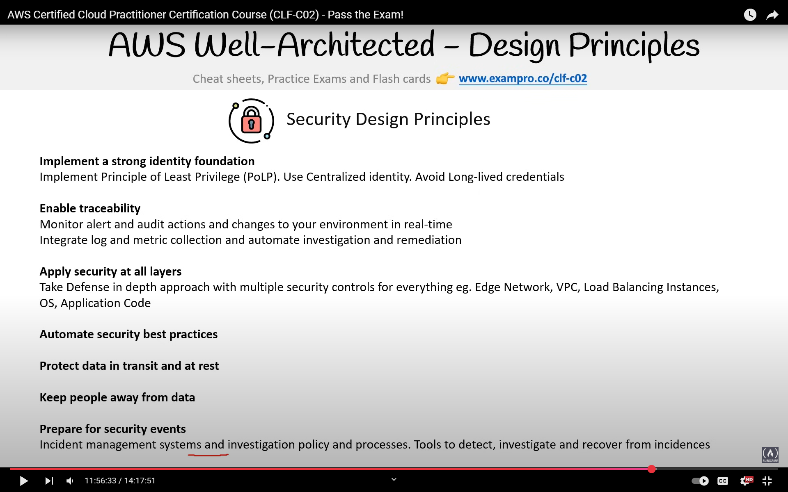
  3. Reliability - Mitigate and recover from disruptions
     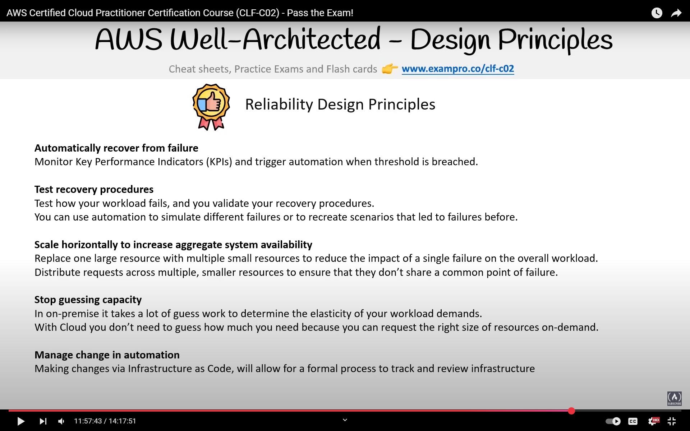
  4. Performance Efficiency - Use compute resources effectively
     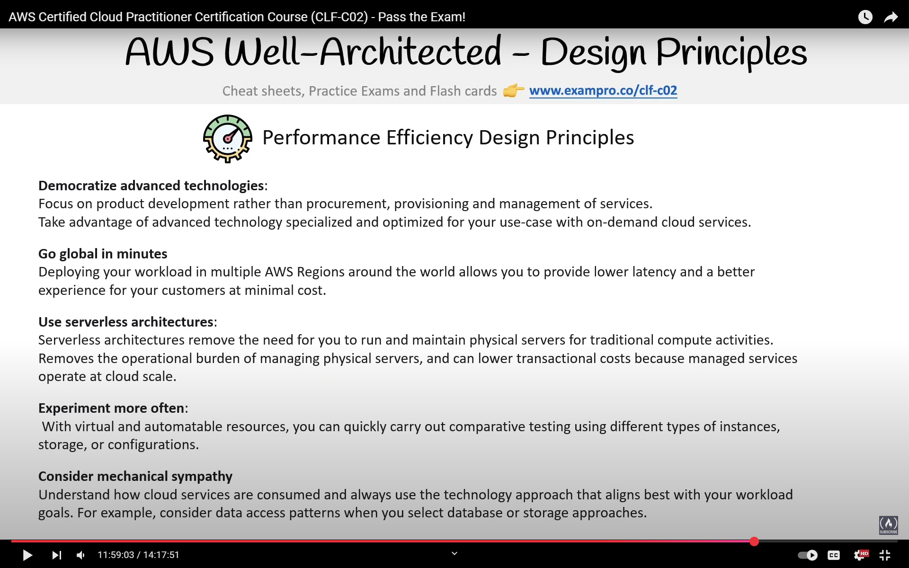
  5. Cost Optimization - Get lowest price
     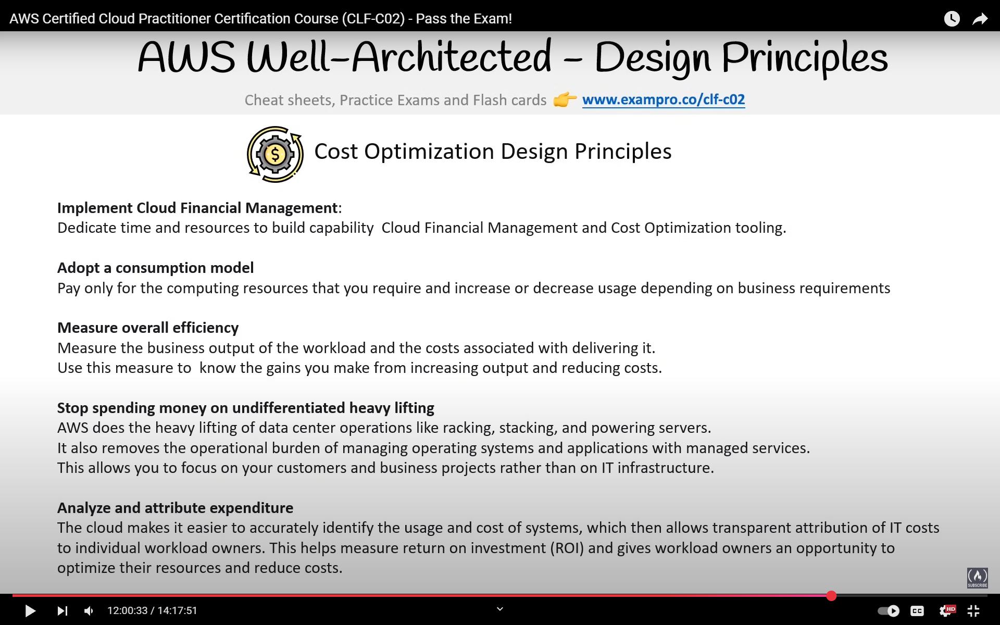
- Each pillar has its own whitepaper
- Important definitions:
  - Component - Code, configuration and resources against requirements
  - Workload - Set of components
  - Milestones - Key changes in architecture through product lifecycle
  - Architecture - How components work together in a workload
  - Technology Portfolio - A collection of workloads for business operations

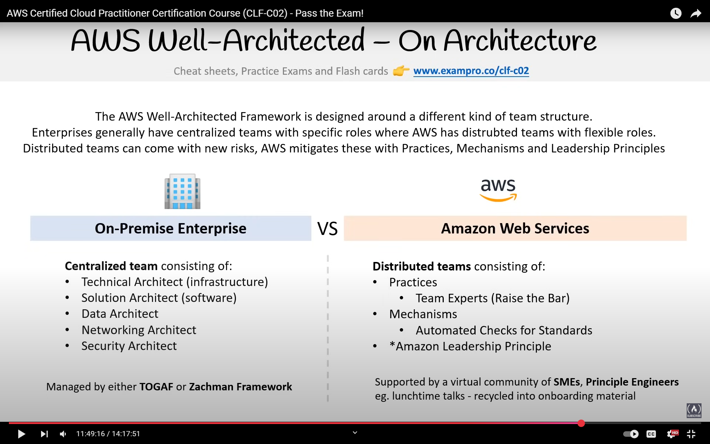
