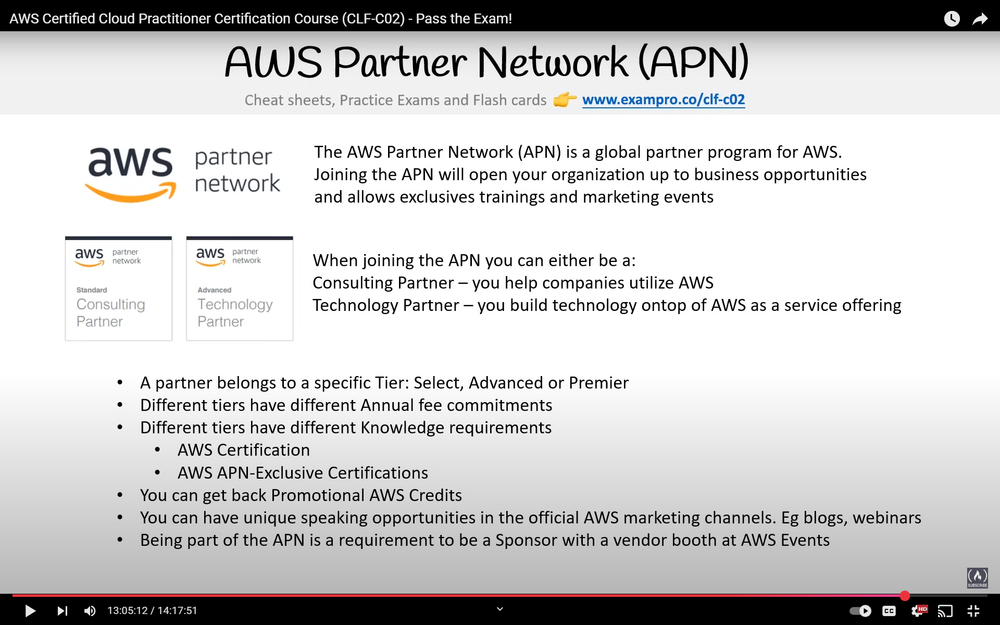

## AWS Well-Architected Tool

- Auditing tool used to assess your cloud workloads for alignment against AWS Well-Architected Framework
- AWS Architecture Center is a web portal containing best practices and reference architectures

## Total Cost of Ownership (TCO)

- A financial estimate for buyers and owners to determine cost of services
  

- Research stated by Gartner indicates that cloud services can be initially more expensive than running on-premises data centers, but become more cost-effective over time as organizations learn to use and operate them efficiently

### Cost Management Tools

- calculator.aws - AWS Pricing Calculator
- AWS Migration Evaluator (formerly TSO Logic) - Tool to estimate on-premises costs and compare against AWS cloud migration costs

### Migration Tools

- AWS supports VM import/export
  - Compatible with VMware, Citrix, Hyper-V, VHD from Azure
  - Uses S3 for storage before migrating to EC2
- AWS Database Migration Service
  - Supports 10+ database services
  - Includes schema conversion tool for SQL to NoSQL migrations

## AWS Support Plans

### AWS Technical Account Manager (TAM)

## AWS Marketplace

- Digital catalog containing thousands of software listings from independent vendors
- Products can be free or paid, with charges included in AWS bill

## Billing and Cost Management

### Consolidated Billing

- Requires AWS Organizations account
- AWS treats all accounts as one for billing purposes
- Can use Cost Explorer service at no additional charge
- Includes volume discounts across accounts

### AWS Trusted Advisor

- Recommendation tool that automatically monitors AWS accounts and provides recommended actions
- Functions as an automated best practices checklist
- Five categories:
  - Cost optimization
  - Performance
  - Security
  - Fault tolerance
  - Service limits

## AWS Service Level Agreements (SLA)

## Service Health Monitoring

- AWS Service Health Dashboard - Shows general status of AWS services
- AWS Personal Health Dashboard - Shows alerts specific to your environment

### AWS Abuse

- Service to report abuse
  

### AWS Partner Network

## Cost Management Tools

### AWS Budgets

- First two budgets are free
- $0.02 per day after, with 20,000 budgets limit
  
- AWS Budget Reports - Service to email budget performance reports daily, weekly, or monthly

### AWS Cost and Usage Reports (CUR)

- Generates detailed spreadsheets stored in S3
- Can be queried using Amazon Athena
- Visualized using Amazon QuickSight
- Available in hourly, daily, or monthly intervals
- Formats: CSV (GZIP) or Parquet

### Cost Allocation Tags

- Optional metadata for better cost analysis
- Two types:
  - User-defined
  - AWS-generated

### Billing and Alarms

- Uses CloudWatch service
- Offers more control than budgets

### AWS Cost Explorer

- Visualize, understand, and manage AWS costs and usage over time
- Supports grouping and filtering for detailed analysis
- Consider using bills for simpler analysis

### AWS Pricing API

- Programmatically access AWS service pricing
- Two API versions:
  1. Query API - Returns JSON data
  2. Batch API - Returns HTML data
- Optional SNS notifications for pricing updates

### AWS Savings Plans

- Recommendations for cost savings based on usage patterns
